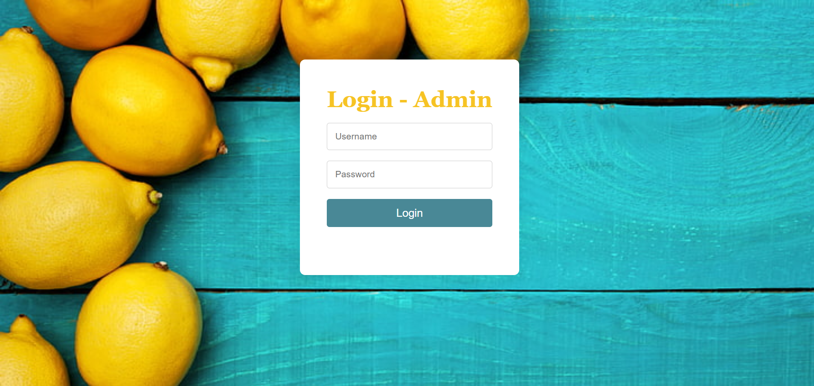
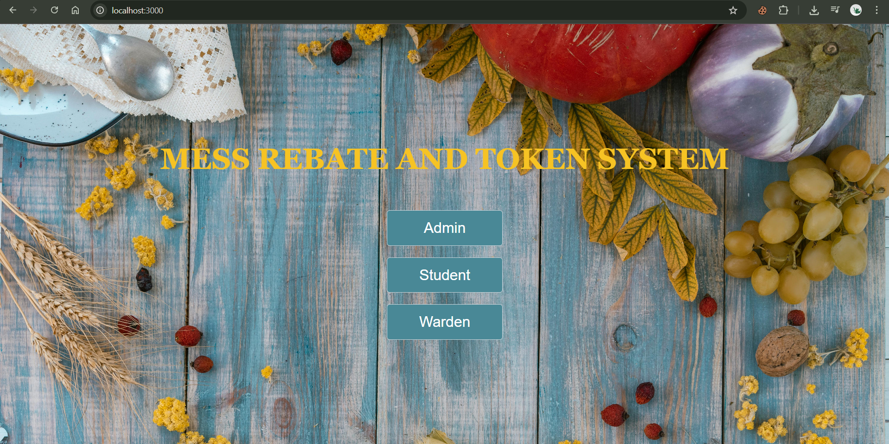
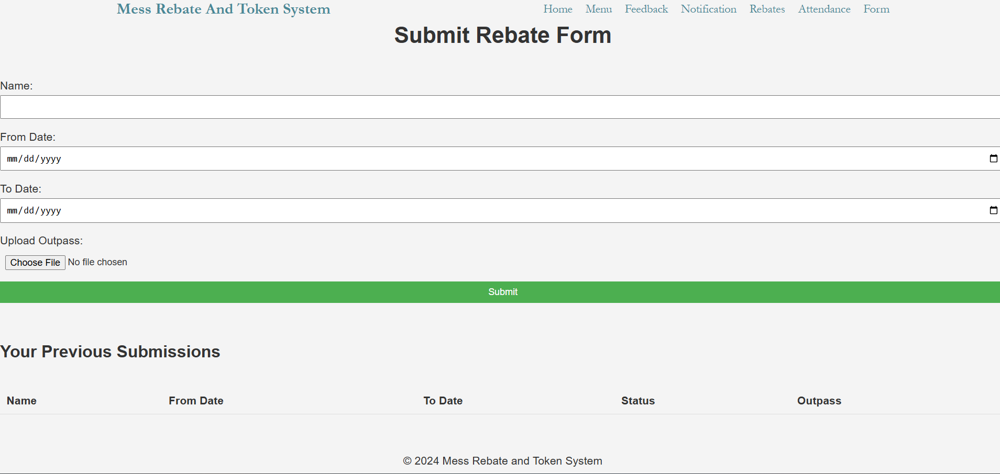
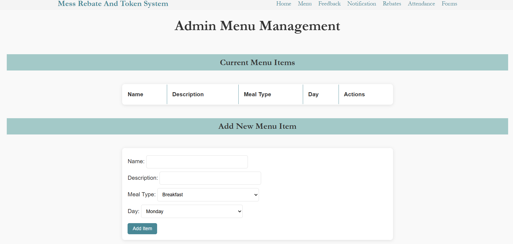
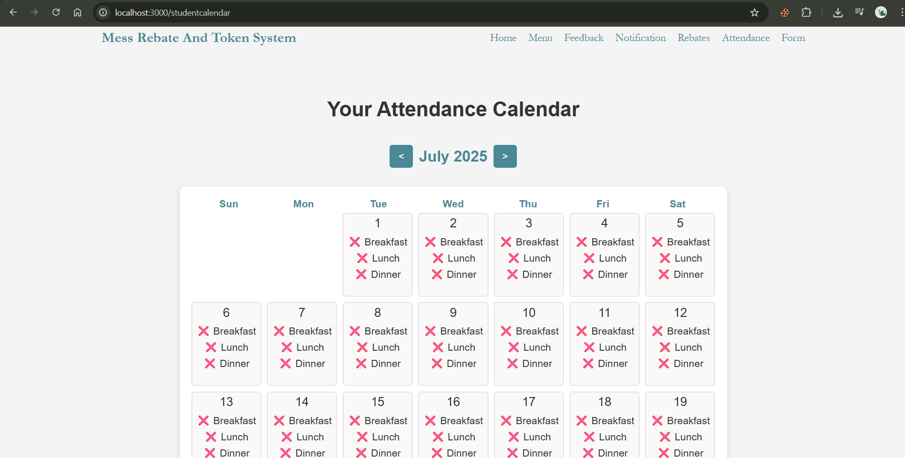
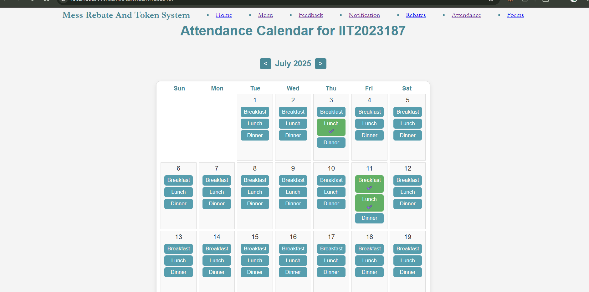
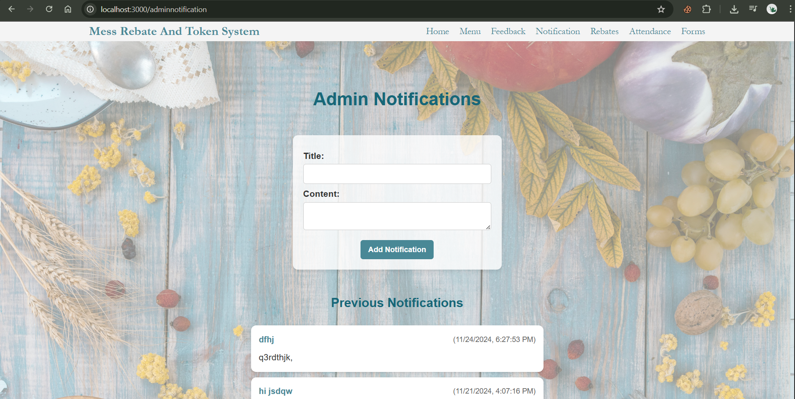
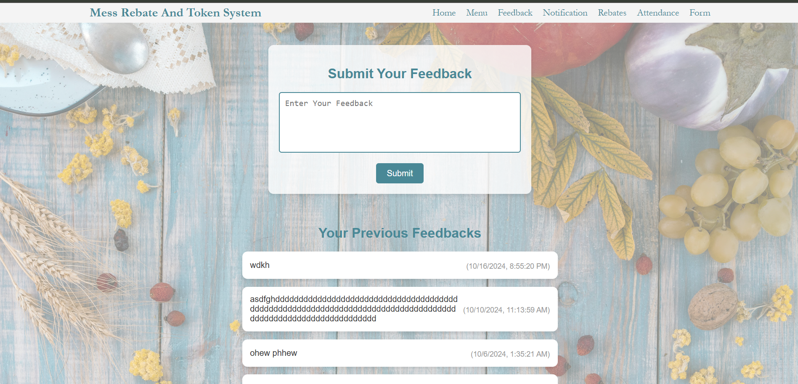

# 🍽️ Mess Rebate and Token Management System

A full-featured web application designed to streamline student mess operations by automating attendance tracking, rebate calculation, meal feedback, and notifications — all in one platform.

---

## 📌 Project Overview

The **Mess Rebate and Token System** simplifies meal tracking and rebate distribution for college messes. It helps reduce food wastage, ensures fair rebates, and offers a smooth experience to both students and mess administrators.

---

## 🎯 Goals and Objectives

- **Reduce Food Wastage:** Allow students to skip meals in advance, so food isn't prepared unnecessarily.
- **Ensure Fair Rebates:** Calculate meal-based rebates accurately, based on real attendance.
- **Improve User Experience:** Provide a user-friendly and responsive portal for easy access to mess services.
- **Streamline Operations:** Replace manual tracking with automated systems to reduce errors and save time.

---

## 👥 Target Users

- **Students**  
- **Mess Wardens**  
- **Mess Managers/Admins**

Only users with registered credentials (pre-fed usernames and passwords) can access the system.

---

## ✨ Key Features

### ✅ Attendance System
- **Real-Time Tracking** of student meal participation.
- **Limitations on Meal Skipping**: Students can skip up to **15 out of 90 meals per month**.

### ✅ Rebate Management
- **Automated Rebate Calculation** based on attendance and pre-defined policies.
- **Transparency** in rebate distribution.

### ✅ Absence Management
- **Advance Reporting** for vacations or holidays.
- **Verification by Manager** to ensure absentees aren't wrongly charged.

### ✅ Food Feedback System
- Students can **submit feedback** or suggestions on meals.
- Admins can **analyze trends** to improve food quality.

### ✅ Notifications and Timetables
- **Live Mess Menu and Timetable** display.
- **Event Announcements** for special meals, fasting days, etc.
- **Reminder Alerts** for meal times and updates.

---

## 💻 Tech Stack

### Frontend
- **HTML5**, **CSS3**, **JavaScript**
- **Bootstrap** for responsive design
- **React.js** and **WordPress** (for GUI enhancements)

### Backend
- **Node.js** with **Express.js**

### Database
- **MongoDB**

---

## 🔧 Dependencies

- `express`
- `mongoose`
- `hbs`
- `body-parser`
- `multer`
- `nodemailer`
- `express-session`
- `nodemon`

---

## ⚙️ Installation & Setup

### 🔨 Prerequisites
- Node.js (v14+)
- MongoDB (local or cloud)
  
### 🛠️ Steps to Run the Project Locally

1. **Clone the Repository**
   ```bash
   git clone https://github.com/sumankr15/mess_rebate_website.git

   
## 🖼️ Screenshots
### 🔐 Login Page


### 🧾 Rebate Dashboard


### 🧾 Student Rebate Form Submission


### 🧾 Admin Mess-Menu Management


### 🧾 Student Mess Attendence



### 🧾 Notification By Admin


### 🧾 Review By Students



